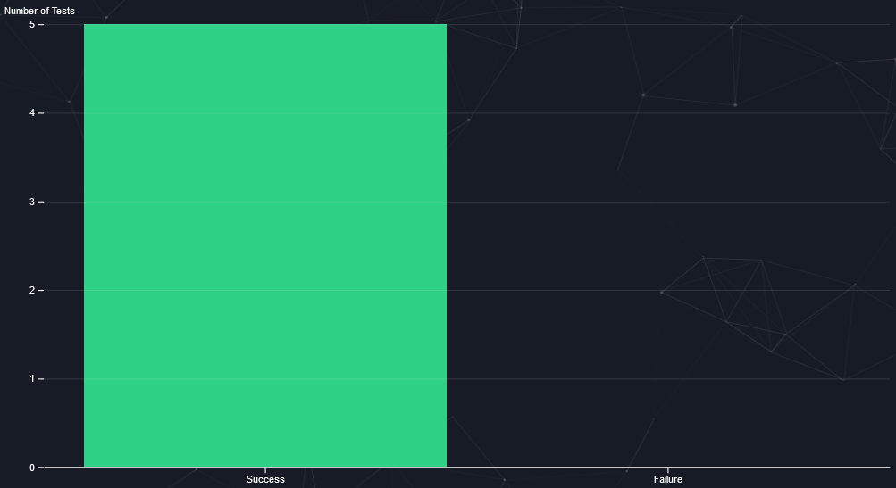

---

# Welcome to our Synthesizer!

This tool is designed to verify a while_lang program with synthesis techniques. By utilizing constraint synthesis methods, our platform fills in missing integer holes in your code. Explore
the possibilities with our interactive interface.

## Project Submission

| Full Name       | Student ID |
| --------------- | ---------- |
| Liav Barsheshet |            |
| Elshan Geydarov |            |

## Brief

In the early stages, we focused on how to approach building the tool, carefully considering the environment and
programming languages that would best suit our needs. Given the power and flexibility of Z3 in Python, we decided to
leverage our full-stack knowledge to create a full-stack Python web application. This web application will serve as the
core tool for our project, providing both an intuitive interface and robust functionality for users.

## Installation

1. **Install Flask and Z3-solver**  
   Run the following command to install both Flask and Z3-solver:

   ```bash
   pip install flask z3-solver

   ```

2. **Run main.py**
   After installation, you can run the application by executing main.py
   ```bash
   python main.py
   ```

> ⚠️ Please make sure that port 5001 is available!, if not consider changing it in main.py to other available port.

## Getting Started

### Important Notes

1. In our while_lang syntax we replaced the equality operator "=" with "==".
2. Inputs and outputs should be written as Boolean expression using `and`, `or` a good example for it is:

   `❌ lambda d: d[x] >= 5`

   `✅ x >= 5`

3. Please make sure your expressions has bracelet `(` `)` for complex expressions such, a good example for this is:

   `❌ e == 8 and f == 3 and difference == 0`

   `✅ ( ( e == 8 ) and ( f == 3 ) ) and ( difference == 0 )`

4. Please avoid using variable names such as `num\d*` or `hole\d*`.

_With the exception of these minor adjustments, the while_lang syntax from the course should remain the same._

### Implemented Features & Support

1. The tool combines **Feature 1** and **Feature 2** for a more generalized approach, eliminating the need to select
   between different modes.
2. **Unroll support** has been added for `while` statements.
3. We have provided a **rich yet simple** user interface for ease of use.
4. The tool can **auto-detect variables** in the program, removing the need to manually specify `PVars`.
   > ⚠️ Please ensure that the variable appears within the program for proper detection!
5. The tool only supports **integer holes**.
6. Our tool support's `%`,`/`,`**` operators.
   > ⚠️ Our division is truncated and \*\* works only for non variables as exponential.

### Playground

After installing the required libraries and running `main.py`, a web page should automatically open in your browser. If
it doesn't, you can manually access it by clicking on this URL: [`http://localhost:5001`](http://localhost:5001).

#### Exploring the User Interface


---

1. **Dropdown List of Modes**: Explore various examples (modes). The "User Input" mode allows you to customize and
   interact with the tool directly.
2. **Linv Parameter**: When working with a `while` statement, you need to provide a Boolean expression for the loop
   invariant.
3. **Main Input and Output**: Supply `P` (precondition) and `Q` (postcondition) as Boolean expressions, representing the
   initial input and output. (By default you will start with only 1 example)
4. **Additional Input and Output**: To support multiple inputs and outputs, you can add more as needed.
5. **Remove Input/Output**: Option to remove the current input/output.
6. **Add Input/Output**: Add additional inputs and outputs to the synthesizer.
7. **Program Field**: Input the `while_lang` program here.
8. **Reset Button**: Resets the form to its initial values based on the selected mode.
9. **Synthesize Button**: Initiates the synthesis process.

#### Output (Feedback)

After synthesizing your first program, the tool will provide feedback. The tool supports multiple synthesis runs while
preserving all previous feedback from different executions.

We will demonstrate the feedback process with an example:


---

_In this example, the output will be successful, but in other cases, the tool can detect errors and notify you of the
issue._

1. **Output Console**: A read-only section displaying the output, you can find it by scrolling after the buttons.
2. **Feedback Format**: Each feedback is formatted as `[i] Response: {Feedback}`, where `i` represents the synthesis
   number, and `Feedback` is a summary message that could also include error details.
3. **Input Evaluation**: The tool will confirm if the input evaluation succeeded and display how long it took in
   seconds. If not, you'll receive an "invalid input" message.
4. **Program Parsing**: It parses the provided program, informs you if the syntax is valid, and shows how long the
   parsing took in seconds.
5. **Sketching**: If sketching is required, the tool will return the completed program without holes or assertions.
6. **Hole Filling**: The tool indicates how long it took (in seconds) to fill the holes.
7. **HW3 Verification**: The tool performs HW3 verification, confirms if it succeeded, and displays the duration in
   seconds.
8. **Synthesis Completion**: A message indicating the synthesis process is finished.
9. **Synthesis Mode**: Displays the mode used for this synthesis run.
10. **HTTP Status Code**: Shows the HTTP status code of the request.
11. **Synthesis Completion Status**: Indicates whether the synthesis was successfully completed.
12. **Request Timestamp**: Shows when the request arrived at the server.
13. **Elapsed Time**: Displays how much time elapsed after the request arrived at the server.

#### Now you are a playground master and can play with the tool as you wish! 😁

### Benchmark

We also provided a benchmark mode for our tool. You can access the benchmark page through the navigation menu or by
visiting this URL: [Benchmark Page](http://localhost:5001/benchmark).

#### Exploring the User Interface


---

1. **A JSON benchmark input** (By default it will load our benchmark JSON file, but feel free to create a custom one 😁).
2. **Begin button**, which will start running over the tests provided in the JSON test file.

#### JSON Test File Structure

The JSON file should contain an array of `Test Objects`.

#### Test Object

| Property  | Type                       | Description                            |
| --------- | -------------------------- | -------------------------------------- |
| `p`       | `Array[BooleanExpression]` | An array of input Boolean expressions  |
| `q`       | `Array[BooleanExpression]` | An array of output Boolean expressions |
| `linv`    | `BooleanExpression`        | Loop invariant as a Boolean expression |
| `program` | `string`                   | The program to be synthesized          |
| `asserts` | `Boolean[3]`               | The expected result for the test       |

_`BooleanExpression` is a string like the input of p in the playground ("x >= 0")._

**Explanation of the `asserts` Property**

- **assert[0]**: If `True`, the program syntax and evaluation should pass; otherwise, False.
- **assert[1]**: If `True`, the sketching process should succeed; otherwise, False.
- **assert[2]**: If `True`, the entire synthesis procedure should pass; otherwise, False.

#### JSON Test File Example (With only a single test)

```JSON
[
  {
    "p": ["True"],
    "q": ["a == b"],
    "linv": "a == b",
    "program": "a := b ; while i < n do ( a := a + 1 ; b := b + 1 )",
    "assert": [true, true, true]
  }
]
```

#### Benchmark Output

The benchmark operation can be run multiple times to provide comparative analysis between different benchmarks. The
results are demonstrated through graphs to help visualize performance and differences across runs.

To help you understand the results, we will demonstrate the process using a simple benchmark example.


#### Current Benchmark Graph

Analyzes the performance of each individual test within the current benchmark tests.

_Where `x` is the `test number` and `y` is `elapsed time` in milliseconds._


#### Current Success Rate Graph

Displays the number of individual tests within the current benchmark that have succeeded (According to assert prop).

_Where `x` is the `Success|Failure` and `y` is `number of tests`._



#### Benchmark Comparison

Analyzes the comparison between benchmarks. This graph will update automatically as more benchmarks are conducted.

_Where `x` is the `benchmark number` and `y` is `elapsed time` in seconds._


#### That's it! 😁

## Authors

[Liav Barsheshet, LBDevelopments](https://github.com/liavbarsheshet)

[Elshan Geydarov](https://github.com/ElshanGeydarov)
